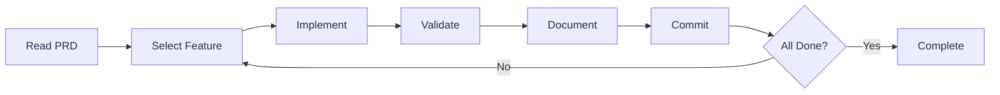

<div align="center">

# 🤖 Ralph

### AI-Powered Development Assistant

**Automated feature development with Claude Code**

[](https://github.com)
[](LICENSE)
[](https://nodejs.org)

*Ralph is an automated development assistant that uses Claude Code to iteratively work through features defined in a Product Requirements Document (PRD). It processes features one at a time, validates code quality, tracks progress, and commits work automatically.*

</div>

---

## 📋 Table of Contents

- [✨ Why Ralph?](#-why-ralph)
- [🚀 Quick Start](#-quick-start)
- [📦 Prerequisites](#-prerequisites)
- [⚙️ Project Setup](#️-project-setup)
- [💻 Usage](#-usage)
- [🔍 How It Works](#-how-it-works)
- [📚 Example Workflow](#-example-workflow)
- [❓ Troubleshooting](#-troubleshooting)
- [💡 Best Practices](#-best-practices)
- [🔗 Additional Resources](#-additional-resources)

---

## ✨ Why Ralph?

Ralph automates the tedious parts of development so you can focus on what matters:

- 🔄 **Iterative Development** - Works through features systematically, one at a time
- ✅ **Quality Assurance** - Runs type checking and tests automatically
- 📊 **Progress Tracking** - Keeps detailed logs in `progress.txt`
- 🎯 **Git Automation** - Commits each completed feature automatically
- 🚀 **Time-Saving** - Stop manually managing the build-test-deploy cycle
- 🎨 **PRD-Driven** - Your requirements document drives the entire process

---

## 🚀 Quick Start

Get Ralph up and running in 5 minutes:

```bash
# 1. Install dependencies
npm install -g @anthropic-ai/claude-code
npm install -g @z_ai/coding-helper

# 2. Configure your API key
coding-helper auth glm_coding_plan_global <your-token>

# 3. Set up your project
mkdir -p .ai
touch .ai/progress.txt
# Create your prd.json (see below)

# 4. Run Ralph!
ralph
```

> **💡 Tip:** First time? Start with `ralph 1` to test a single iteration.

---

## 📦 Prerequisites

Before using Ralph, you need to set up the following:

### 1. Node.js ≥ v18.0.0

**Mac:**
```bash
brew install node
```

**Windows:**
Download and install from [nodejs.org](https://nodejs.org/)

---

### 2. Claude Code

Claude Code is the CLI tool that Ralph uses to interact with Claude AI.

**Mac/Linux:**
```bash
npm install -g @anthropic-ai/claude-code
```

**Windows (PowerShell as Administrator):**
```powershell
npm install -g @anthropic-ai/claude-code
```

> **⚠️ Permission Issues?** Use `sudo npm install -g` (Mac/Linux) or `npx @anthropic-ai/claude-code` without global install.

---

### 3. GLM Coding Plan Setup

Ralph requires a GLM Coding Plan API key configured through the Coding Tool Helper.

#### Get Your API Key

1. Visit the [Z.AI Open Platform API Keylist](https://z.ai/manage-apikey/apikey-list)
2. Create a new API key for this project

#### Install & Configure

```bash
# Option 1: Run directly
npx @z_ai/coding-helper

# Option 2: Install globally
npm install -g @z_ai/coding-helper
coding-helper
```

**Quick Configuration Commands:**

```bash
# Configure API key interactively
coding-helper auth

# Or set it directly
coding-helper auth glm_coding_plan_global <your-token>

# Reload plan into Claude Code
coding-helper auth reload claude

# Check system configuration
coding-helper doctor
```

For more details, see the [Coding Tool Helper Documentation](https://docs.z.ai/devpack/extension/coding-tool-helper).

---

## ⚙️ Project Setup

### Required Directory Structure

Ralph expects the following structure in your repository:

```
your-repo/
├── .ai/
│   ├── prd.json          # Product Requirements Document
│   └── progress.txt      # Progress tracking file
└── start.sh              # Ralph script
```

### Creating the `.ai` Directory

**Mac/Linux:**
```bash
mkdir -p .ai
```

**Windows:**
```cmd
mkdir .ai
```

---

### PRD File Format

Create `.ai/prd.json` with your features:

**`.ai/prd.json`**
```json
[
  {
    "category": "ui (Example)",
    "description": "Delete video shows confirmation dialog before deleting",
    "scope": "Video list pages, video detail pages",
    "steps": [
      "Navigate to a video",
      "Click delete button",
      "Verify 'Are you sure?' confirmation dialog appears",
      "Click cancel",
      "Verify video is not deleted",
      "Click delete again and confirm",
      "Verify video is deleted"
    ],
    "passes": false
  }
]
```

**Field Descriptions:**

| Field | Description |
|-------|-------------|
| `category` | The category or type of feature (e.g., "ui", "api", "backend") |
| `description` | A brief description of what the feature should do |
| `scope` | The areas or components affected by this feature |
| `steps` | Array of step-by-step instructions or acceptance criteria |
| `passes` | Boolean indicating whether the feature is completed |

---

### Progress File

Create `.ai/progress.txt` (can be empty initially):

**Mac/Linux:**
```bash
touch .ai/progress.txt
```

**Windows:**
```cmd
type nul > .ai/progress.txt
```

---

## 💻 Usage

### Installing Ralph as a Global Command

To use `ralph` from any repository, you need to add it to your shell configuration or PATH.

#### 🍎 Mac/Linux

**Option 1: Add to Shell Config (Recommended)**

Add this function to your `~/.zshrc` or `~/.bash_profile`:

**`~/.zshrc`**
```bash
ralph() {
    /path/to/ralph/start.sh "$@"
}
```

Replace `/path/to/ralph` with your actual path.

Then reload:
```bash
source ~/.zshrc
```

---

**Option 2: Add to PATH**

```bash
# Navigate to ralph directory
cd /path/to/ralph

# Rename and make executable
mv start.sh ralph
chmod +x ralph

# Add to PATH (in ~/.zshrc or ~/.bash_profile)
export PATH="/path/to/ralph:$PATH"

# Reload shell
source ~/.zshrc
```

---

#### 🪟 Windows

**Option 1: Using Git Bash (Recommended)**

```bash
# Navigate to ralph directory
cd /c/path/to/ralph

# Rename and make executable
mv start.sh ralph
chmod +x ralph

# Add to PATH (in ~/.bashrc)
export PATH="/c/path/to/ralph:$PATH"

# Reload shell
source ~/.bashrc
```

---

**Option 2: Using PowerShell/CMD**

Create `ralph.bat` in a directory in your PATH:

**`ralph.bat`**
```batch
@echo off
bash C:\path\to\ralph\start.sh %*
```

Then add the directory to your Windows PATH via System Properties → Environment Variables.

---

**Option 3: Using WSL**

Follow the Mac/Linux instructions above, within your WSL environment.

---

### Using Ralph

Once installed, you can use `ralph` from any repository:

```bash
# Navigate to any repository
cd /path/to/your/project

# Run ralph with default 30 iterations
ralph

# Or specify a custom number of iterations
ralph 10
```

**Ralph automatically:**

- ✅ Looks for `.ai/prd.json` in the current repository
- ✅ Uses `.ai/progress.txt` for tracking progress
- ✅ Works through features one at a time
- ✅ Exits early if the PRD is complete

---

## 🔍 How It Works



**The Process:**

1. **🎯 Feature Selection** - Analyzes the PRD and selects the highest-priority feature
2. **💻 Implementation** - Claude Code implements the feature
3. **✅ Validation**
   - Runs type checking (`npx/npm/pnpm typecheck`)
   - Runs tests (`npx/npm/pnpm test`)
4. **📝 Documentation** - Updates the PRD and appends progress to `progress.txt`
5. **📦 Commit** - Creates a git commit for the completed feature
6. **🎉 Completion** - Exits with a completion message when all features are complete

---

## 📚 Example Workflow

```bash
# Navigate to your project repository
cd ~/projects/my-app

# Start with 10 iterations (explicit)
ralph 10

# Or use default (30 iterations)
ralph

# Ralph will:
# 🔄 Iteration 1: Work on highest priority feature
# 🔄 Iteration 2: Work on next feature
# 🔄 ... continues until PRD is complete or iterations run out
```

---

## ❓ Troubleshooting

<details>
<summary><b>🔧 Claude Code Not Found</b></summary>

**Error:** `command not found: claude`

**Solutions:**

```bash
# Verify Claude Code is installed
npm list -g @anthropic-ai/claude-code

# Check your PATH includes npm global bin directory
# Mac: Add to ~/.zshrc
export PATH="$PATH:$(npm config get prefix)/bin"

# Windows: Add npm global path to System Environment Variables
```
</details>

---

<details>
<summary><b>🔑 API Key Issues</b></summary>

**Error:** API Key invalid or authentication failures

**Solutions:**

```bash
# Reconfigure your API key
coding-helper auth

# Or set directly
coding-helper auth glm_coding_plan_global <your-token>

# Reload into Claude Code
coding-helper auth reload claude

# Check configuration
coding-helper doctor
```
</details>

---

<details>
<summary><b>🌐 Network Errors</b></summary>

**Error:** Network timeout or connection errors

**Solutions:**

```bash
# Check your internet connection

# If using a proxy, configure Node.js proxy settings
# Mac/Linux
export HTTP_PROXY=http://your.proxy.server:port
export HTTPS_PROXY=http://your.proxy.server:port

# Windows (PowerShell)
$env:HTTP_PROXY="http://your.proxy.server:port"
$env:HTTPS_PROXY="http://your.proxy.server:port"
```
</details>

---

<details>
<summary><b>🔒 Permission Denied (Mac/Linux)</b></summary>

**Error:** `EACCES: permission denied`

**Solutions:**

```bash
# Use sudo for global npm installs
sudo npm install -g ...

# Or use npx to avoid global installs
npx @anthropic-ai/claude-code

# Consider using nvm to manage Node.js versions
# https://github.com/nvm-sh/nvm
```
</details>

---

<details>
<summary><b>📁 Missing .ai Directory</b></summary>

**Error:** `'.ai' directory not found`

**Solutions:**

```bash
# Ensure you're in the repository root
cd /path/to/your/repository

# Create the directory
mkdir -p .ai

# Create required files
touch .ai/prd.json .ai/progress.txt
```
</details>

---

<details>
<summary><b>⚡ Script Not Executable (Mac/Linux)</b></summary>

**Error:** `Permission denied`

**Solutions:**

```bash
# Make the script executable
chmod +x start.sh
```
</details>

---

## 💡 Best Practices

1. **🎯 Start Small** - Begin with 1-2 iterations to test your setup
2. **👀 Review Commits** - Check git commits after each iteration
3. **📊 Monitor Progress** - Review `progress.txt` to understand what Ralph is working on
4. **📝 Update PRD** - Keep your PRD file updated with accurate feature descriptions
5. **🔄 Version Control** - Commit your PRD and progress files to track changes

---

## 🔗 Additional Resources

- [📖 Claude Code Documentation](https://docs.anthropic.com/claude/docs/claude-code)
- [🛠️ Coding Tool Helper Documentation](https://docs.z.ai/devpack/extension/coding-tool-helper)
- [🌐 Z.AI Open Platform](https://platform.z.ai/)

---

<div align="center">

**Made with ❤️ for developers**

[⬆ Back to Top](#-ralph)

</div>
